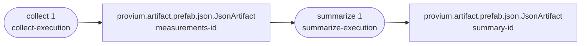
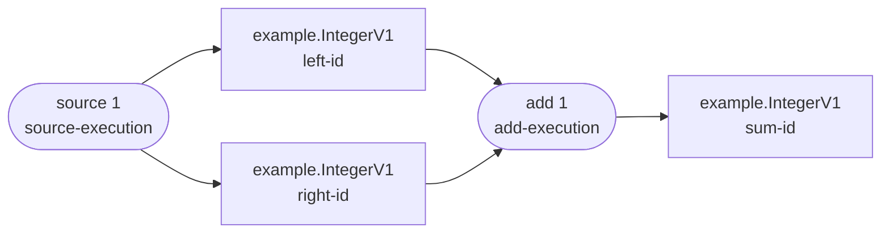

# Provium

[](https://pypi.org/project/provium/)
[](https://pypi.org/project/provium/)
[](https://pypi.org/project/provium/)

[Documentation](https://provium.dlii.tech) ·
[PyPI](https://pypi.org/project/provium/) ·
[Issues](https://github.com/SirDavidLudwig/provium/issues)

Provium helps you build processing workflows whose results explain where they
came from. Store a result as an artifact, use that artifact as input to another
step, and save the new outputs as artifacts of their own. Provium records those
relationships automatically as your workflow runs.

Each processing step is represented by a versioned procedure. When a procedure
reads existing artifacts and creates new ones, Provium links the outputs to the
procedure and its inputs. That lineage travels with every result, including its
full upstream history, so a final artifact can be traced back through every
intermediate result and the procedures that produced them.

This keeps provenance out of your application logic: you work with inputs,
perform the computation, and write outputs inside a procedure execution. Provium
handles the dependency graph, integrity metadata, and lifecycle of those
artifacts for you.

## Features

- Typed readers and writers for application-specific artifact formats
- Automatic input, output, and procedure lineage
- SHA-256 payload integrity checks
- Streaming, body-relative I/O
- Runtime artifact discovery through Python entry points
- Optional configuration snapshots, including Pydantic v2 models
- No required runtime dependencies

## Installation

Provium requires Python 3.12 or newer.

```bash
python -m pip install provium
```

## Quick start

Provium includes `JsonArtifact` for storing JSON-compatible values. This example
records a collection of measurements and produces a summary:

```python
from provium import JsonArtifact, Procedure

COLLECT = Procedure(name="collect", version="1")
SUMMARIZE = Procedure(name="summarize", version="1")

with COLLECT.execute():
    measurements = JsonArtifact.create("measurements.pa")
    measurements.write({"measurements": [12.5, 14.0, 13.5]})

with SUMMARIZE.execute():
    measurements = JsonArtifact.open("measurements.pa")
    payload = measurements.read()
    assert isinstance(payload, dict)
    values = payload["measurements"]
    assert isinstance(values, list)
    readings = [float(value) for value in values]

    summary = JsonArtifact.create("summary.pa")
    summary.write(
        {
            "count": len(readings),
            "minimum": min(readings),
            "maximum": max(readings),
            "average": round(sum(readings) / len(readings), 2),
        }
    )
```

`summary.pa` contains `count`, `minimum`, `maximum`, and `average`, together with
the lineage of the measurements and the procedures that collected and
summarized them. A rendered graph looks like this, with identities shortened for
readability:



When each context exits successfully, Provium closes its handles and finalizes
its output files. If a context exits with an exception, its pending outputs are
not committed. Readers and writers are bound to their execution and cannot be
used after its context exits.

`JsonArtifact` uses deterministic UTF-8 JSON encoding and supports null,
booleans, finite numbers, strings, arrays, and objects with string keys.

## Custom artifact types

For an application-specific artifact format, define reader and writer classes,
then create an artifact instance. Here is the same number workflow using
signed 64-bit integers:

```python
import struct

from provium import Artifact, ArtifactReader, ArtifactWriter

from .definitions import INTEGER_ARTIFACT

INTEGER = struct.Struct(">q")


class IntegerReader(ArtifactReader):
    def read(self) -> int:
        return INTEGER.unpack(self.body.read(INTEGER.size))[0]


class IntegerWriter(ArtifactWriter):
    def write(self, value: int) -> None:
        self.body.write(INTEGER.pack(value))


IntegerArtifact = Artifact(
    identifier=INTEGER_ARTIFACT.identifier,
    label="Integer",
    reader=IntegerReader,
    writer=IntegerWriter,
)
```

Use the custom type just like the prefab JSON artifact:

```python
from provium import session

from your_package.artifacts import IntegerArtifact

SOURCE = Procedure(name="source", version="1")
ADD = Procedure(name="add", version="1")

with SOURCE.execute():
    left = IntegerArtifact.create("left.pa")
    left.write(2)

    right = IntegerArtifact.create("right.pa")
    right.write(3)

with ADD.execute():
    left = IntegerArtifact.open("left.pa")
    right = IntegerArtifact.open("right.pa")
    total = IntegerArtifact.create("sum.pa")
    total.write(left.read() + right.read())
```

The workflow has the same lineage, now with application-specific integer
artifacts. Identities are again shortened in the diagram:



Every artifact carries a required persistent identifier, so typed calls such as
`IntegerArtifact.open()` work without catalog discovery.

Register a lightweight definition when you want dynamic loading through
`provium.open_artifact()`:

```python
from provium import ArtifactCatalog, ArtifactDefinition

INTEGER_ARTIFACT = ArtifactDefinition(
    identifier="example.IntegerV1",
    target="your_package.artifacts:IntegerArtifact",
    description="A signed 64-bit integer.",
)

catalog = ArtifactCatalog()
catalog.register(INTEGER_ARTIFACT)
```

Expose that catalog from `pyproject.toml` so Provium can discover it:

```toml
[project.entry-points."provium.artifact_catalogs"]
example = "your_package.catalog:catalog"
```

## Inspecting provenance

Every reader exposes the artifact header and lineage:

```python
from provium import Procedure

from your_package.artifacts import IntegerArtifact

with session():
    artifact = IntegerArtifact.open("sum.pa")
    print(artifact.read())
    print(artifact.identity)
    print(artifact.artifact_identifier)
    print(artifact.lineage.to_json())
```

Use `provium.open_artifact()` when the concrete type should be resolved from the
identifier stored in the file rather than selected in advance.

## Reusing artifacts across procedures

A session records every artifact opened within it, even after its reader is
closed. Procedure executions inherit those recorded inputs and create a nested
session for artifacts used only by that execution:

```python
from provium import Procedure, session

PREDICT = Procedure(name="predict", version="1")

with session():
    model_reader = ModelArtifact.open("model.pa")
    model = load_model(model_reader)
    model_reader.close()

    for input_path, output_path in jobs:
        with PREDICT:
            data = DataArtifact.open(input_path)
            result = model.predict(data.read())
            ResultArtifact.create(output_path).write(result)
```

Each result depends on the shared model and its own data artifact. Nested
generic sessions similarly inherit artifacts recorded by their ancestors.

Calling a procedure creates a lazy, configured procedure instance. The instance
can be entered repeatedly inside one session; every entry is a fresh execution.
A setup callback can load shared state once and keep its input artifacts open
until the owning session exits:

```python
from dataclasses import dataclass

from provium import Procedure, session


@dataclass
class PredictState:
    model: object


def setup_predict(settings: Settings) -> PredictState:
    reader = ModelArtifact.open(settings.model_path)
    return PredictState(model=load_model(reader))


PREDICT = Procedure(
    name="predict",
    version="1",
    config_codec=SettingsCodec(),
    setup=setup_predict,
)

predict = PREDICT(config=settings)  # Setup remains lazy here.

with session():
    for input_path, output_path in jobs:
        with predict as execution:
            data = DataArtifact.open(input_path)
            result = execution.state.model.predict(data.read())
            ResultArtifact.create(output_path).write(result)
```

The model is included in every execution's provenance, while each data input is
local to only its own execution. The configured instance is permanently bound
to the session where setup first runs and cannot be reused after that session
closes. Use `execute()` when an explicit standalone, single-use execution
context is needed.

## Command-line tools

Inspect an artifact's generic metadata without loading its concrete artifact
type:

```bash
provium inspect result.pa
```

Pass `--body` to include artifact-specific body inspection when the artifact
type is installed and its reader provides an inspector:

```bash
provium inspect --body result.pa
```

Generate Mermaid or Graphviz source for an artifact's complete lineage:

```bash
provium graph --renderer mermaid result.pa lineage.mmd
provium graph --renderer graphviz result.pa lineage.dot
```

Image output supports SVG, PNG, and PDF and defaults to the Mermaid renderer:

```bash
provium graph result.pa lineage.svg
provium graph --renderer graphviz result.pa lineage.png
```

Mermaid image rendering requires the official `mmdc` executable. Graphviz
rendering requires the optional Python package and Graphviz system package:

```bash
npm install --global @mermaid-js/mermaid-cli
python -m pip install 'provium[visualization]'
```

The output type is inferred from its extension. Library callers can use the
functions in `provium.tool` to produce Mermaid or DOT source and to receive
rendered images as bytes.

## Development

Create a virtual environment and install the project with its test dependencies:

```bash
python3 -m venv .venv
source .venv/bin/activate
python -m pip install --upgrade pip
python -m pip install -e '.[test]'
```

Run the complete repository checks from the workspace root:

```bash
make check
```

This runs Ruff linting and formatting checks, Pyright against the public typing
fixtures, and both package test suites. The project requires 100% statement and
branch coverage for the `provium` package.

## License

Provium is available under the [MIT License](LICENSE).
